# Olin Beauty Inventori V2 — Carta Alir Sistem

Versi: `olin-v2-M6-2026.06.12` | Render dengan [Mermaid Live](https://mermaid.live)

---

## 1. Gambaran Keseluruhan Sistem

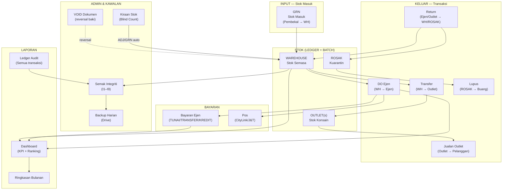

---

## 2. Aliran Stok Masuk (GRN)

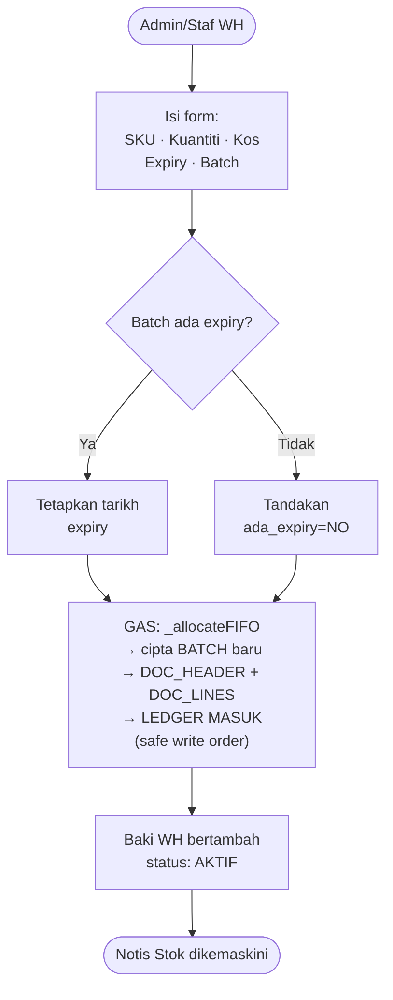

---

## 3. Aliran DO Ejen (Delivery Order)

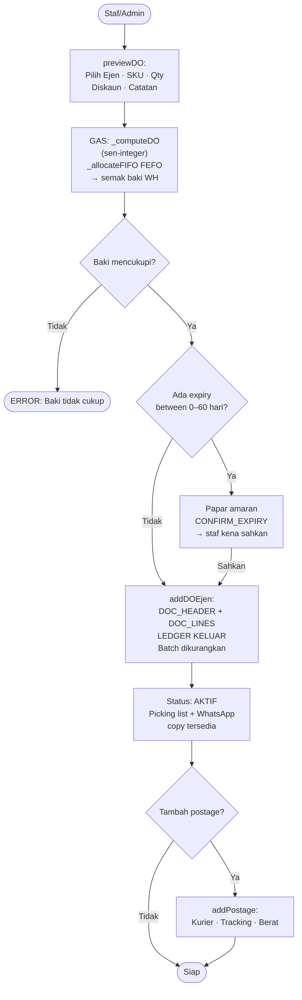

---

## 4. Aliran Bayaran Ejen

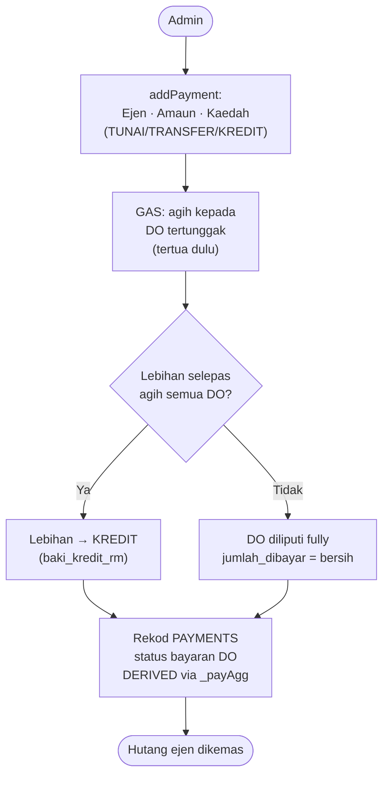

---

## 5. Aliran Transfer (WH → Outlet)

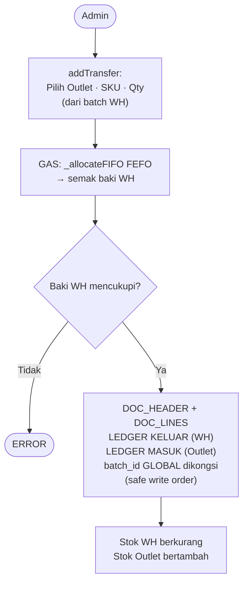

---

## 6. Aliran Jualan Outlet

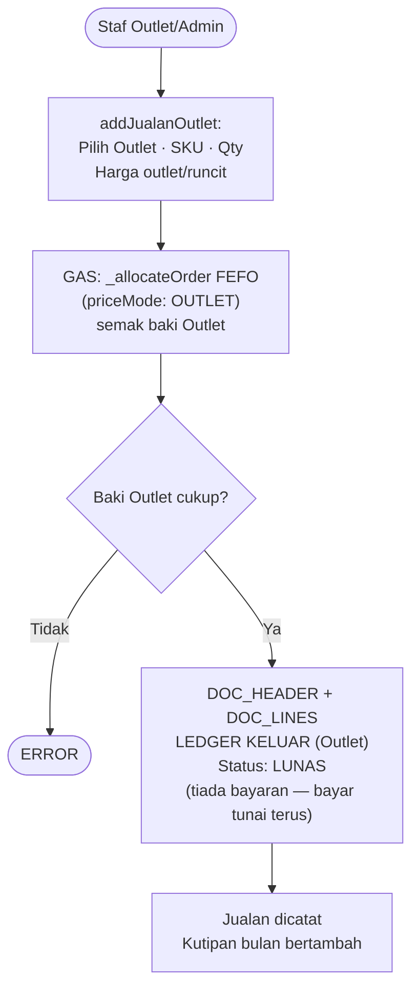

---

## 7. Aliran Return

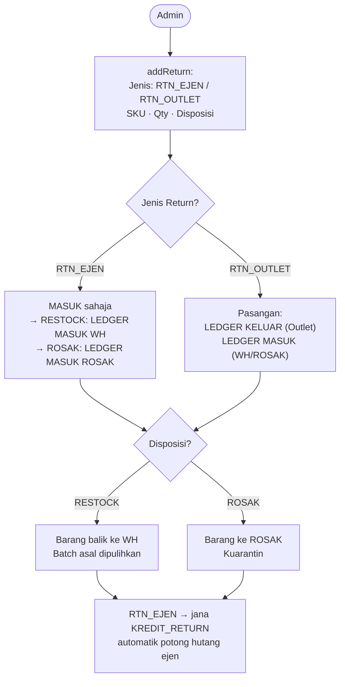

---

## 8. Aliran VOID Dokumen

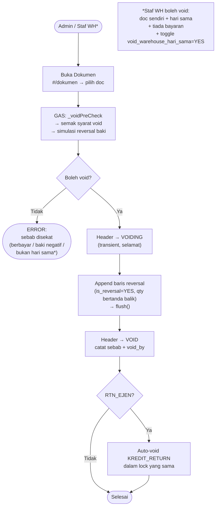

---

## 9. Aliran Kiraan Stok (Blind Count)

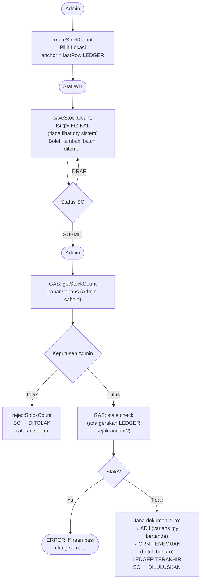

---

## 10. Aliran Integriti & Backup (Automatik)

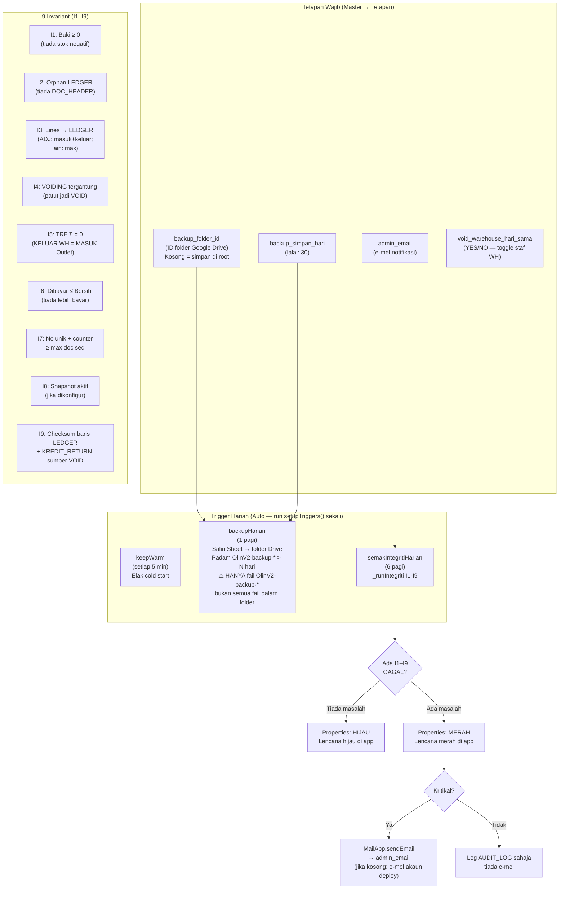

---

## 11. Aliran Log Masuk & Hak Akses

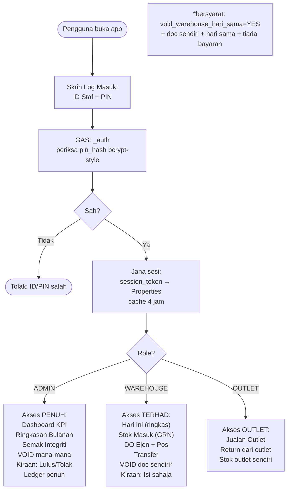

---

## 12. Ringkasan Bulanan (Recompute-on-Read)

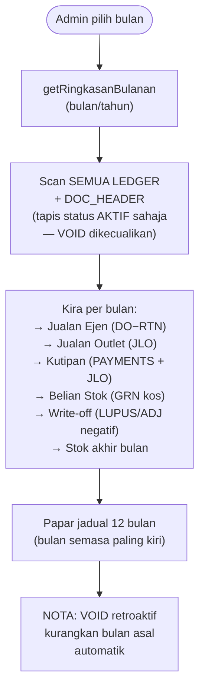

---

## Glosari Cepat

| Istilah | Maksud |
|---|---|
| LEDGER | Semua pergerakan stok (append-only, TIDAK boleh edit) |
| BATCH | Lot stok fizikal (expiry + kos seunit) |
| FEFO | First-Expired-First-Out — keluar yang expiry awal dulu |
| VOID | Batalkan dokumen → jana baris reversal dalam LEDGER |
| VOIDING | Status sementara semasa proses void (elak double-void) |
| ROSAK | Lokasi kuarantin stok rosak/returned |
| ADJ | Adjustment — varians kiraan stok, qty bertanda (+/−) |
| GRN | Goods Received Note — stok masuk dari pembekal |
| DO | Delivery Order — hantar stok ke ejen |
| JLO | Jualan Langsung Outlet |
| TRF | Transfer WH → Outlet |
| RTN | Return dari ejen/outlet |
| KREDIT_RETURN | Kredit auto-jana dari RTN_EJEN untuk potong hutang |
| sc_status | Status kiraan stok (DRAF/SUBMIT/DILULUSKAN/DITOLAK) |
| _ok envelope | `{status:'SUCCESS', ...payload}` — status ditetap TERAKHIR |
| SEN integer | Wang dikira dalam sen (×100) elak floating-point ralat |
